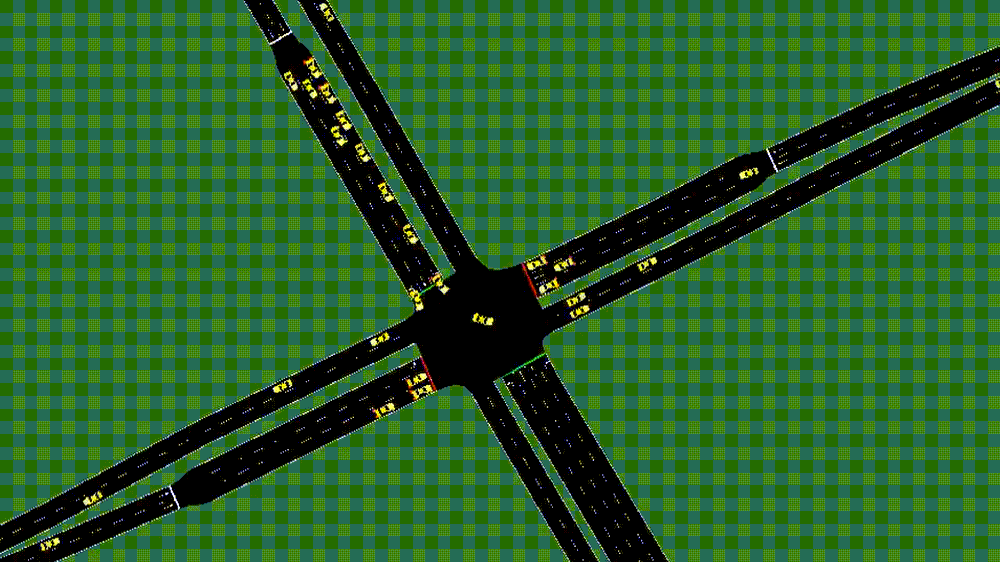

# 🚦 RL Traffic Control with SUMO

[](https://eclipse.dev/sumo/)
[](https://www.python.org/)
[](https://pytorch.org/)
[](https://stable-baselines3.readthedocs.io/)
[](https://gymnasium.farama.org/)
[](https://github.com/LucasAlegre/sumo-rl)
[](https://www.docker.com/)
[](https://www.latex-project.org/)

> Master's thesis: *A Study on the Effectiveness of Reinforcement Learning in Adaptive Traffic Control.*
> Can a Deep Q-Network control a real intersection better than the signal plans traffic engineers actually deploy?



## 🌟 Highlights

- A **reinforcement learning traffic signal controller** (DQN) trained and evaluated on a microscopic model of a real Warsaw intersection: Belgradzka St. / al. Komisji Edukacji Narodowej.
- Two **classic baselines** implemented to a realistic engineering standard: fixed-time control with a demand-proportional green split, and gap-based actuated control.
- A **leak-free experimental protocol**: separate training, validation and test scenario sets. Baseline timings, training length and hyperparameters are all derived from training and validation data only.
- **Fully containerised** training and evaluation, so every run starts from the same SUMO and Python environment.
- **Reproducible results**: the traffic scenarios, the final model, the raw result CSVs and the plotting notebook are all in this repository.

### Headline result

Mean delay in seconds per vehicle on the held-out test set (5 scenarios per demand level, lower is better):

| Method | Low | Medium | High | Variable |
| --- | ---: | ---: | ---: | ---: |
| Fixed-time | 28.00 | 30.91 | 65.45 | 48.25 |
| Actuated (gap-based) | 15.22 | 18.02 | 78.07 | 39.76 |
| **DQN** | **13.90** | **17.79** | **51.82** | **34.23** |

The agent wins at every demand level. The gap-based baseline is competitive when traffic is light, but degrades badly at saturation, exactly where gaps between vehicles stop appearing.

## ℹ️ Overview

Traffic signals are still overwhelmingly controlled by plans that are either fixed in advance or driven by simple detector rules. Both react poorly when demand changes in ways their designer did not anticipate. Reinforcement learning is an appealing alternative, because an agent can learn a control policy directly from interaction instead of having the rules written down for it.

This repository contains the complete experimental setup for my master's thesis at Warsaw University of Technology, which tests that idea on a single busy intersection modelled in [SUMO](https://eclipse.dev/sumo/). A DQN agent observes the active green phase, a minimum-green flag, and the per-lane density and queue occupancy across 13 inbound lanes, which is a 30-dimensional vector. Every 5 simulated seconds it picks which of the 3 green phases should be active. The environment enforces the same safety constraints a real controller has: a minimum green time and a mandatory yellow transition. The reward is the change in accumulated waiting time at the intersection.

The agent is compared against fixed-time and actuated control on the same test scenarios and with the same metrics: delay, waiting time, queue length, throughput and switching frequency. The study also covers the parts that are easy to skip and easy to get wrong: choosing the training length from validation curves rather than taking the last checkpoint, checking whether noisier training data actually improves generalisation (it did not), a one-factor-at-a-time hyperparameter sweep, and a deliberate counter-example showing that a model with poor validation scores also generalises poorly to the test set.

The thesis text itself (Polish, LaTeX) lives in [docs](docs).

### ✍️ Authors

Built by [@Tombiczek](https://github.com/Tombiczek) as a master's thesis project at the Faculty of Electronics and Information Technology, Warsaw University of Technology.

## 🚀 Usage

Build the container image once, then run everything through it.

```bash
docker build -f src/dqn/Dockerfile -t thesis-dqn .
```

Train an agent:

```bash
docker run --rm -v "$PWD":/workspace --platform=linux/amd64 thesis-dqn train \
  --sumocfg-file /workspace/data/osm.sumocfg \
  --train-route-glob "/workspace/data/train/fixed/routes_train_*.rou.xml" \
  --config-file /workspace/src/dqn/configs/base_config.yml \
  --model-path /workspace/data/models/dqn/my_model.zip
```

Evaluate the included final model on one test scenario:

```bash
docker run --rm -v "$PWD":/workspace --platform=linux/amd64 thesis-dqn evaluate \
  --sumocfg-file /workspace/data/osm.sumocfg \
  --route-file /workspace/data/T3/routes_T3_301.rou.xml \
  --model-path /workspace/data/models/dqn/dqn_final.zip \
  --min-green 5 --yellow-time 3 --decision-interval 5 \
  --method dqn --demand high --seed 301
```

Run a classic baseline across the whole test set:

```bash
./run_baseline.sh actuated osm_actuated.sumocfg 8813
```

Every run appends one row of metrics to `data/results_<method>.csv` and writes the raw SUMO output to `data/out/<method>/`.

## ⬇️ Installation

**Requirements**

- [Docker](https://www.docker.com/). The SUMO image is `linux/amd64`, so on Apple Silicon it runs under emulation.
- Python 3.13 and [uv](https://docs.astral.sh/uv/), needed only for the baseline runner and the plotting notebook.
- About 8 GB of RAM available to Docker if you want to train several configurations in parallel.

**Setup**

```bash
git clone https://github.com/Tombiczek/rl-traffic-control-sumo.git
cd rl-traffic-control-sumo
uv sync                                      # local env for the baselines and the notebook
docker build -f src/dqn/Dockerfile -t thesis-dqn .
```

No SUMO installation on the host is required. The image ships SUMO, `sumo-rl` and Stable-Baselines3.

## 🔁 Reproducing the experiments

All traffic scenarios are committed, so the experiments can be reproduced as they were run. Every command assumes the repository root as the working directory.

**Scenario sets**

| Directory | Role | Demand | Files |
| --- | --- | --- | ---: |
| `data/train/fixed/` | training | light / medium / heavy, regular headways | 30 |
| `data/train/randomized/` | training | same levels, irregular departure times | 30 |
| `data/valid/` | validation | light / medium / heavy / variable | 4 |
| `data/T1/`, `data/T2/`, `data/T3/` | test | light / medium / heavy | 5 each |
| `data/G1/` | test | variable | 5 |

Bring your own `.rou.xml` files if you want to test the controllers under different demand. Nothing in the pipeline is tied to these particular scenarios.

**1. Classic baselines**

Each baseline needs its own TraCI port, so both can run at the same time.

```bash
./run_baseline.sh actuated osm_actuated.sumocfg 8813 &
./run_baseline.sh fixed    osm_static.sumocfg   8814 &
wait
```

**2. Train the agent**

The base configuration runs for 300 000 steps and saves a checkpoint every 25 000 steps.

```bash
docker run --rm -d --name train-fixed \
  -v "$PWD":/workspace --platform=linux/amd64 thesis-dqn train \
  --sumocfg-file /workspace/data/osm.sumocfg \
  --train-route-glob "/workspace/data/train/fixed/routes_train_*.rou.xml" \
  --config-file /workspace/src/dqn/configs/base_config.yml \
  --model-path /workspace/data/models/dqn/dqn_fixed_base_300k.zip \
  --checkpoint-dir /workspace/data/models/checkpoints \
  --checkpoint-freq 25000 --checkpoint-prefix dqn_fixed
```

Swap `train/fixed` for `train/randomized` to repeat the training-data comparison.

**3. Hyperparameter variants**

Each configuration in `src/dqn/configs/` changes one hyperparameter relative to the base and trains for 225 000 steps, so no comparison is confounded by training length. The queue script keeps parallelism and memory use under control:

```bash
MAX_PARALLEL=4 TRAIN_SET=fixed ./run_train_configs.sh
```

Edit the `CONFIGS` array in the script to choose which variants to run.

**4. Validation**

Validation decides the training length and the final configuration. Pass the timing flags explicitly so that training and evaluation stay aligned.

```bash
for model in data/models/checkpoints/*.zip data/models/finetune/*.zip; do
  for route_file in data/valid/routes_valid_*.rou.xml; do
    docker run --rm -v "$PWD":/workspace --platform=linux/amd64 thesis-dqn evaluate \
      --sumocfg-file /workspace/data/osm.sumocfg \
      --route-file "/workspace/${route_file}" \
      --model-path "/workspace/${model}" \
      --min-green 5 --yellow-time 3 --decision-interval 5 \
      --validate
  done
done
```

Results land in `data/validation_results.csv`. The test set stays untouched at this stage.

**5. Test evaluation**

Only after the model is frozen:

```bash
./run_dqn_test.sh data/models/dqn/dqn_final.zip                        dqn &
./run_dqn_test.sh data/models/finetune/dqn_fixed_explore1e-1_225k.zip  dqn-explore1e-1 &
wait

{ head -1 data/results_actuated.csv; tail -n +2 -q data/results_*.csv; } > data/results.csv
```

`dqn_final.zip` is the checkpoint selected during validation (225 000 steps, base configuration, regular training set) and is included in this repository. The second model is the deliberate counter-example: the variant that scored worst in validation.

**6. Plots**

`data/visualise.ipynb` reads the result CSVs and regenerates the figures used in the thesis.

> **Note.** The result CSVs in this repository are the ones the thesis was written from. Evaluation runs *append* rows, so move the existing files aside before a full re-run if you want a clean comparison.

## 🗂️ Repository layout

```
data/           SUMO network, scenario sets, trained models, result CSVs, plotting notebook
docs/           LaTeX source of the thesis
src/baseline/   fixed-time and actuated control driven through plain TraCI
src/dqn/        environment wrapper, training, evaluation, metrics, configurations
run_*.sh        experiment runners
```

## ⚠️ Scope and limitations

This is a research demonstrator, not a deployable controller. It covers a single intersection with synthetic demand, no pedestrians, no coordination between intersections, one RL algorithm and a limited hyperparameter search. Results obtained in simulation do not guarantee the same behaviour in real traffic.

## 💭 Feedback and Contributing

Questions, ideas and corrections are welcome. Open an [issue](https://github.com/Tombiczek/rl-traffic-control-sumo/issues) or start a [discussion](https://github.com/Tombiczek/rl-traffic-control-sumo/discussions).

If you want to extend the work, the most interesting directions are multi-intersection coordination, comparing DQN against other RL algorithms, adding pedestrians, and calibrating demand against real traffic counts.

## 🙏 Acknowledgements

Built on [SUMO](https://eclipse.dev/sumo/), [sumo-rl](https://github.com/LucasAlegre/sumo-rl) by Lucas Alegre, [Stable-Baselines3](https://stable-baselines3.readthedocs.io/) and [Gymnasium](https://gymnasium.farama.org/). The road network is derived from [OpenStreetMap](https://www.openstreetmap.org/) data.